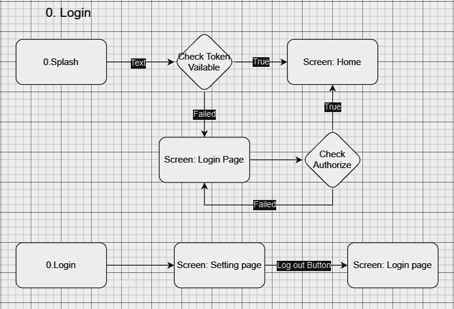
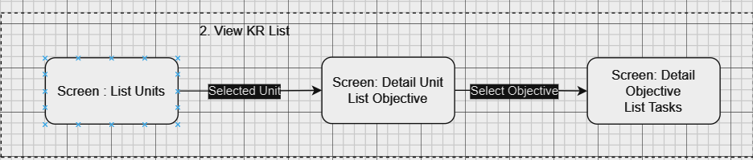
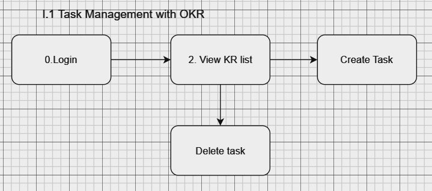
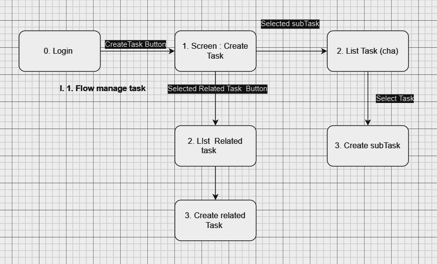
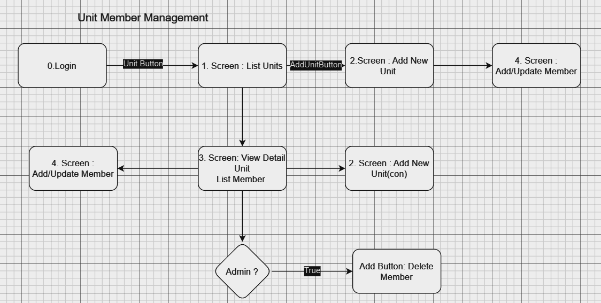
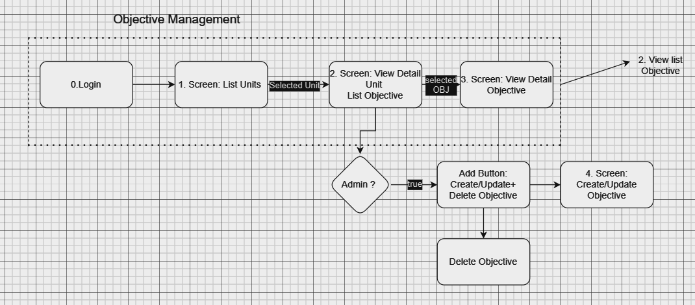
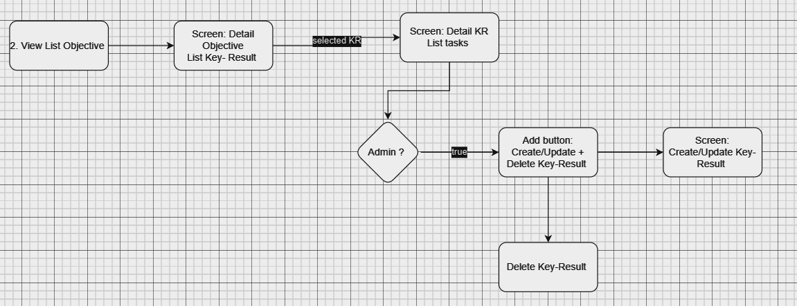
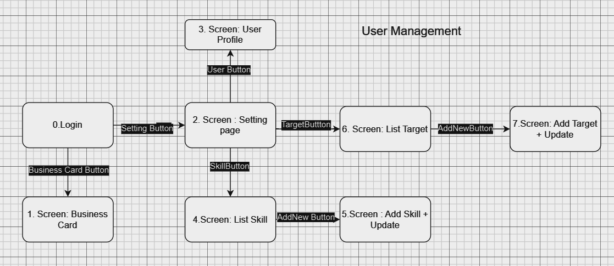

# Active+

A Base Project For Flutter
Eztek LTD

##  Build 1 (15-09-2023):
    Event - Checkin page:
        + Show and filter the events.
        + Show daily report, overview report.
        + Show button add/delete daily report (unclickable).
    Project page:
        + Show the projects list.
--------------------

## Build 2 (25-09-2023):
    
    Event - Checkin page:
        + Setting time for checkin.
        + Show days having event and the events of day.
        + Complete daily/overview report page (even adding page).
        + Complete filter event function.
        + Join in event ('Tham gia ngay' button).
    Membership page:
        + Show business card.
    Project page:
        + Complete the interface of project page.
        + Show projects list, the details of project.
        + Show the members of a project.
        + Add member button (unclickable).
    Setting page:
        + Show the setting page.
        + Show user's information.
        + Change the information (unclickable).
        + Change the password.
        + Log out.

## Screen flow 
0. Login
 

1. Task management
- View list tasks 
 

- Create task quickly 

## 2.Unit Member Management
- Member management

## 3. Objective and Key-Result management

- Objective management

- Key Result management
 

## 4.User management

#### All of sitemaps [here](https://gitlab.eztek.net/ez-check-in/ez-check-in-mobile/-/blob/features/merberDung/ScreenFlow.drawio)